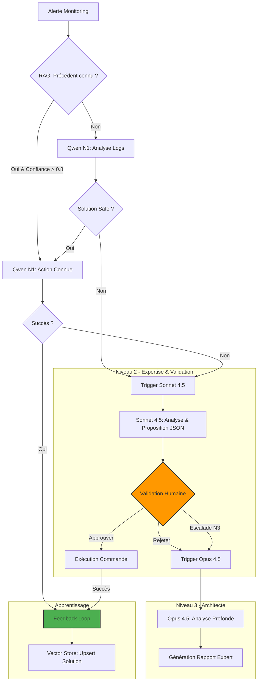

# Architecture AIOps V2 : Système Multi-Agents Auto-Apprenant

**Version :** 2.0 (Spécification pour Implémentation)
**Statut :** RFC (Request For Comments)
**Objectif :** Évolution vers un système Enterprise-Grade avec RAG, Validation Humaine et Escalade Expert (Opus).

---

## 1. Workflow Main_Supervisor – Orchestrateur et Mémoire Immédiate

### Ajustement RAG (Mémoire Immédiate)
Dès la réception d’une alerte, avant tout appel à Qwen (N1), le workflow interroge le Vector Store (Qdrant/Chroma) pour rechercher des précédents similaires.

*   **Requête type :** « Rechercher les 3 derniers incidents similaires pour ce service / cet hôte, avec leur cause identifiée et l’action ayant permis la résolution. »

### Logique Décisionnelle
1.  **Fast Track (Confiance > 0.8) :** Si le RAG retourne une solution éprouvée avec un haut niveau de confiance, l’orchestrateur propose directement cette action à Qwen/N8N pour exécution locale (Zone Gratuite).
2.  **Anti-Loop (Détection Récurrence) :** Si l’incident est récurrent (ex: 5 occurrences en 1h) malgré l’application de la solution, le workflow bypasse le redémarrage et marque l’incident pour escalade immédiate.

> **Gain :** Exploiter l'historique pour éviter de réinventer la roue et stopper les boucles inefficaces.

---

## 2. Workflow Action_Executor – Niveau 2 (Claude Sonnet 4.5) et Gate Humaine

### Conditions d’Activation (Sonnet 4.5)
Claude Sonnet 4.5 est invoqué uniquement si :
1.  Le traitement local (Qwen + actions « safe ») a échoué.
2.  **OU** Le technicien demande explicitement une expertise IA via le ticketing.

### Structure de la Réponse
Sonnet 4.5 ne renvoie pas une commande brute, mais un objet JSON structuré pour faciliter la décision :

```json
{
  "analysis": "Résumé clair de la cause probable (ex: Memory Leak confirmé)",
  "proposed_command": "systemctl restart nginx && ./scripts/clear_cache.sh",
  "risk_level": "MEDIUM",
  "rollback_plan": "Restaurer le snapshot VM-123",
  "explanation": "Le service consomme 98% de RAM. Un restart est nécessaire, mais le cache doit être vidé pour éviter une rechute immédiate."
}
```

### Gate Humaine (Validation Obligatoire)
Le workflow N8N se met en pause (Node "Wait for Webhook") et notifie un humain (Email/Teams/Slack).
L'opérateur dispose de trois options explicites :
*   **[APPROUVER]** : Déclenche l'exécution de la commande proposée par N8N.
*   **[REJETER]** : Refus de la solution (jugée inadaptée ou trop risquée).
*   **[ESCALADE EXPERTE N3]** : Demande d'avis plus approfondi.

---

## 3. Nouveau Workflow N3_Escalation – Claude Opus 4.5 (Expert Ultime)

### Conditions d’Activation (Opus 4.5)
Intervient quand la situation dépasse le N1 et le N2.
*   **Déclencheur Manuel :** Le technicien choisit « Demander expertise approfondie (N3) ».
*   **Déclencheur SLA :** Timeout dépassé (ex: 15 min sans réponse humaine sur incident critique).

### Rôle d’Architecte
Opus 4.5 n'exécute aucune action. Il analyse l'intégralité du contexte (Logs bruts, tentatives Qwen, analyse Sonnet, motifs de rejet humain) et produit un **Rapport d'Expertise** :
*   Résumé chronologique de l’incident.
*   Hypothèse de Root Cause détaillée.
*   Options de remédiation avec analyse d'impact.
*   Recommandations d’amélioration durable (Architecture, Configuration, Monitoring).

> **Output :** Rapport texte enrichi ou PDF pour aide à la décision humaine stratégique.

---

## 4. Feedback Loop – Apprentissage Continu via le RAG

### Cycle d'Apprentissage
Une fois l’incident clos (Status: RESOLVED), le système doit apprendre pour ne plus solliciter les niveaux supérieurs inutilement.

### Processus (Notification_Manager)
1.  **Agrégation :** N8N compile les symptômes, le contexte, l'action *réellement* efficace, le niveau d'escalade final et le coût.
2.  **Synthèse :** Création d'un document textuel synthétique de l'incident.
3.  **Vectorisation :** Envoi vers le service d'embedding (ex: nomic-embed-text).
4.  **Stockage :** Upsert dans le Vector Store (Qdrant/Chroma) avec métadonnées (tags, timestamps, success_rate).

> **Effet :** Le prochain incident similaire sera détecté par le RAG du Main_Supervisor et résolu potentiellement dès le N1.

---

## 5. Résumé des Modifications Techniques N8N

Plan d'action pour la migration V2 :

1.  **Main_Supervisor :** Ajouter nœud **"Vector Store – Read"** en début de chaîne (RAG Initiale).
2.  **Action_Executor :** Ajouter nœud **"Wait for Response"** après l'analyse Sonnet (Gate Humaine).
3.  **N3_Escalation :** Créer ce nouveau workflow dédié à **Claude Opus 4.5** (Rapporteur).
4.  **Notification_Manager :** Ajouter nœud **"Vector Store – Upsert"** en fin de chaîne (Feedback Loop).

---

## Diagramme de Flux V2


